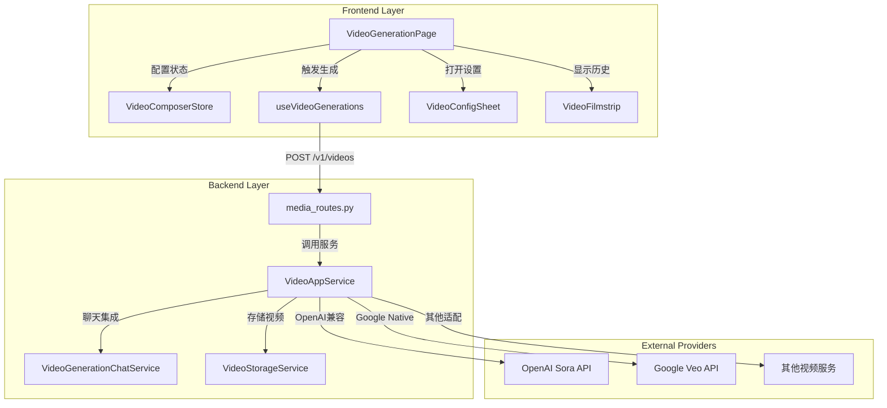

# Architecture Flow: AI Video Generation Page

## Overview

AI视频生成页面采用"Less is More"设计理念，核心架构分为前端展示层和后端服务层。前端基于Next.js App Router + React 19 + Zustand状态管理 + SWR数据获取，后端基于FastAPI + SQLAlchemy + Redis异步处理。

## Module Architecture

### Frontend Modules

#### VideoGenerationPage
- **File**: `frontend/app/video/page.tsx` (待创建)
- **Role**: 视频生成主页面组件，实现"中央悬浮创作岛"UI
- **Dependencies**: `VideoComposerStore`, `useVideoGenerations`, UI Components

#### VideoComposerStore (Zustand)
- **File**: `frontend/lib/stores/video-composer-store.ts` (待创建)
- **Role**: 管理视频生成配置状态（prompt、比例、模型、高级参数）
- **Dependencies**: zustand, persist middleware
- **Pattern**: 参考 `image-generation-store.ts`, `chat-composer-store.ts`

#### useVideoGenerations (SWR Hook)
- **File**: `frontend/lib/swr/use-video-generations.ts` (待创建)
- **Role**: 视频生成API调用和状态管理
- **Dependencies**: SWR, http client
- **Pattern**: 参考 `use-image-generations.ts`

#### VideoConfigSheet (UI Component)
- **File**: `frontend/components/video/video-config-sheet.tsx` (待创建)
- **Role**: 高级配置抽屉面板（模型选择、运镜控制、Seed等）
- **Dependencies**: Sheet/Drawer, Form components

#### VideoFilmstrip (UI Component)
- **File**: `frontend/components/video/video-filmstrip.tsx` (待创建)
- **Role**: 底部胶卷展示区，横向滚动显示历史生成
- **Dependencies**: ScrollArea, Video preview cards

### Backend Modules

#### VideoGenerationRequest/Response (Schemas)
- **File**: `backend/app/schemas/video.py:6-79`
- **Role**: 统一的视频生成请求/响应模型
- **Fields**: prompt, model, size, seconds, aspect_ratio, resolution, negative_prompt, seed, fps等

#### VideoAppService
- **File**: `backend/app/services/video_app_service.py:285-693`
- **Role**: 视频生成核心服务，复用ProviderSelector进行多候选调度
- **Dependencies**: ProviderSelector, RoutingStateService, video_storage_service

#### VideoGenerationChatService
- **File**: `backend/app/services/video_generation_chat_service.py:1-211`
- **Role**: 对话式视频生成服务，创建Run并管理消息流
- **Dependencies**: VideoAppService, chat_history_service, run_event_bus

#### VideoStorageService
- **File**: `backend/app/services/video_storage_service.py:1-345`
- **Role**: 视频文件存储服务（本地/阿里OSS/S3）
- **Dependencies**: settings, oss2/boto3

## Flow Diagram

## Key Interactions

- **Page → Store**: 用户输入更新Zustand状态，实现响应式UI
- **Page → Hook**: 点击生成按钮触发SWR mutation
- **Hook → Routes**: HTTP POST请求携带VideoGenerationRequest
- **AppService → Providers**: 基于ProviderSelector选择最优候选并发起上游调用
- **AppService → Storage**: 下载视频内容并存储到OSS/本地，返回签名URL

## Entry Points

- **Frontend Entry**: `/video` 路由页面 - 用户访问入口
- **API Entry**: `POST /v1/videos/generations` - 视频生成API端点
- **Chat Entry**: `execute_video_generation_inline()` - 对话内嵌生成

## Design Patterns Applied

| Pattern | Location | Description |
|---------|----------|-------------|
| Zustand Store | `video-composer-store.ts` | 配置状态持久化，跨组件共享 |
| SWR Mutation | `use-video-generations.ts` | API调用、加载状态、错误处理 |
| Provider Selector | `VideoAppService` | 多候选负载均衡和故障转移 |
| Adapter Pattern | `_call_openai_videos`, `_call_google_veo` | 统一接口适配不同上游 |
| Repository Pattern | `VideoStorageService` | 抽象存储后端（本地/OSS/S3）|
