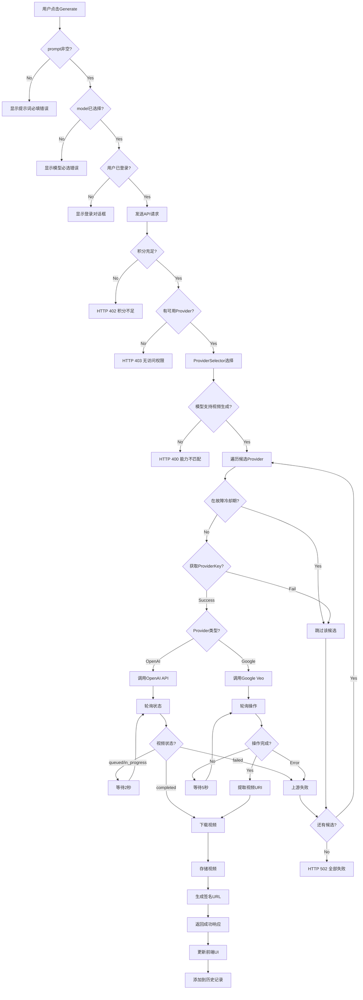
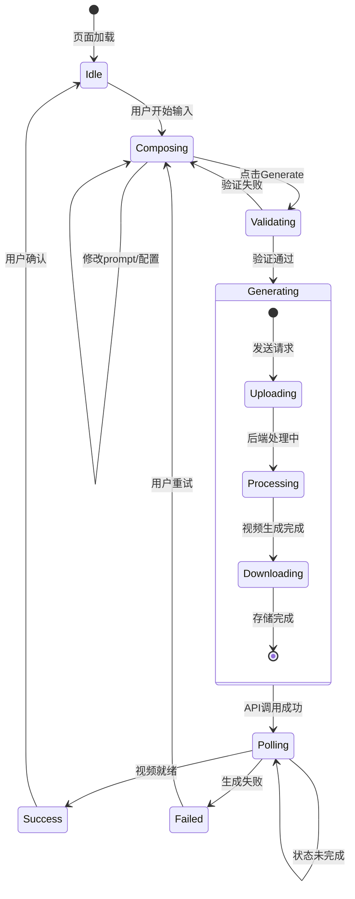

# Conditional Paths: AI Video Generation Page

## Decision Tree



## Branch Conditions

### Frontend Validation Branches

| Condition | File | True Path | False Path |
|-----------|------|-----------|------------|
| `prompt.trim().length > 0` | `page.tsx` | 继续提交 | 显示验证错误 |
| `selectedModel !== ''` | `page.tsx` | 继续提交 | 显示模型必选 |
| `isAuthenticated` | `page.tsx` | 发送请求 | 显示登录弹窗 |
| `isGenerating` | `page.tsx` | 禁用按钮 | 启用按钮 |

### Backend Account Validation

```python
# backend/app/services/video_app_service.py:319-329
ensure_account_usable(self.db, user_id=self.api_key.user_id)
```

| Condition | True Path | False Path |
|-----------|-----------|------------|
| 账户余额 >= 0 | 继续处理 | `InsufficientCreditsError` → HTTP 402 |
| 账户未禁用 | 继续处理 | HTTP 403 |

### Provider Access Branches

```python
# backend/app/services/video_app_service.py:331-346
accessible_provider_ids = get_accessible_provider_ids(db, api_key.user_id)
if api_key.has_provider_restrictions:
    effective_provider_ids &= allowed
```

| Condition | True Path | False Path |
|-----------|-----------|------------|
| `len(accessible_provider_ids) > 0` | 继续选择 | HTTP 403 "无可用提供商" |
| `effective_provider_ids` 非空 | 继续选择 | HTTP 403 "API Key限制" |

### Model Capability Check

```python
# backend/app/services/video_app_service.py:357-362
caps = set(selection.logical_model.capabilities or [])
if ModelCapability.VIDEO_GENERATION not in caps:
    raise HTTPException(400, "该模型不支持视频生成能力")
```

### Provider Type Detection

```python
# backend/app/services/video_app_service.py:402-423
if _is_google_native_provider_base_url(base_url):
    resp = await self._call_google_veo_predict_long_running(...)
else:
    resp = await self._call_openai_videos(...)
```

| Condition | Detection Logic | API Style |
|-----------|-----------------|-----------|
| `netloc == "generativelanguage.googleapis.com"` | Google Native | Veo predictLongRunning |
| 其他 | OpenAI Compatible | /v1/videos multipart |

### OpenAI Status Polling

```python
# backend/app/services/video_app_service.py:541-558
st = _extract_openai_video_status(st_payload) or ""
if st in {"queued", "in_progress", "processing"}:
    await anyio.sleep(2.0)
    continue
if st == "failed":
    raise HTTPException(502, message or "video generation failed")
if st not in {"completed", "succeeded"}:
    raise HTTPException(502, f"unexpected status: {st}")
```

### Google Operation Polling

```python
# backend/app/services/video_app_service.py:667-673
if isinstance(st_payload, dict) and st_payload.get("done") is True:
    if isinstance(st_payload.get("error"), dict):
        raise HTTPException(502, str(msg or "video generation failed"))
    uri = _extract_google_video_download_uri(st_payload)
    if not uri:
        raise HTTPException(502, "no video uri")
```

### Retryable Error Decision

```python
# backend/app/services/video_app_service.py:493-497
if retryable and resp.status_code in (500, 502, 503, 504, 429, 404, 405):
    await self.routing_state.increment_provider_failure(provider_id)
    raise _RetryableCandidateError()
```

| HTTP Status | Retryable | Action |
|-------------|-----------|--------|
| 400, 401, 403 | No | 立即返回错误 |
| 404, 405, 429 | Yes | 跳到下一候选 |
| 500, 502, 503, 504 | Yes | 跳到下一候选 |
| 其他 | No | 立即返回错误 |

## Error Handling

### Frontend Error Display

```typescript
// 错误类型映射
interface VideoError {
  code: string;
  message: string;
  details?: Record<string, unknown>;
}

const errorMessages: Record<string, string> = {
  'CREDIT_NOT_ENOUGH': '积分不足，请充值后重试',
  'NO_PROVIDER': '暂无可用的视频生成服务',
  'MODEL_NOT_SUPPORTED': '所选模型不支持视频生成',
  'UPSTREAM_TIMEOUT': '视频生成超时，请稍后重试',
  'UPSTREAM_FAILED': '上游服务暂时不可用',
};
```

### Backend Error Responses

| Error Type | HTTP Code | Response Body |
|------------|-----------|---------------|
| `InsufficientCreditsError` | 402 | `{code: "CREDIT_NOT_ENOUGH", message, balance}` |
| Provider forbidden | 403 | `{message: "当前用户暂无可用的提供商"}` |
| Capability mismatch | 400 | `{message: "该模型不支持视频生成能力"}` |
| All providers failed | 502 | `{detail: "All upstream providers failed..."}` |
| Generation timeout | 504 | `{detail: "video generation timeout"}` |
| Signed URL expired | 403 | `{detail: "signed url expired"}` |

### Storage Error Paths

```python
# backend/app/services/video_storage_service.py
class VideoStorageNotConfigured(RuntimeError):
    # OSS/S3 未配置时抛出
    pass

class SignedVideoUrlError(RuntimeError):
    # 签名验证失败时抛出
    pass
```

| Condition | Error | Recovery |
|-----------|-------|----------|
| `IMAGE_OSS_*` 未配置 | `VideoStorageNotConfigured` | 回退到local模式 |
| URL签名过期 | `SignedVideoUrlError` | 重新请求签名URL |
| 签名不匹配 | `SignedVideoUrlError` | 拒绝访问 |

## UI State Machine



## Timeout Configurations

| Stage | Timeout | Action on Timeout |
|-------|---------|-------------------|
| HTTP请求 | 120s | httpx.TimeoutError |
| OpenAI轮询 | 600s (10min) | HTTP 504 |
| Google轮询 | 900s (15min) | HTTP 504 |
| 签名URL有效期 | 3600s (1h) | 重新请求 |
