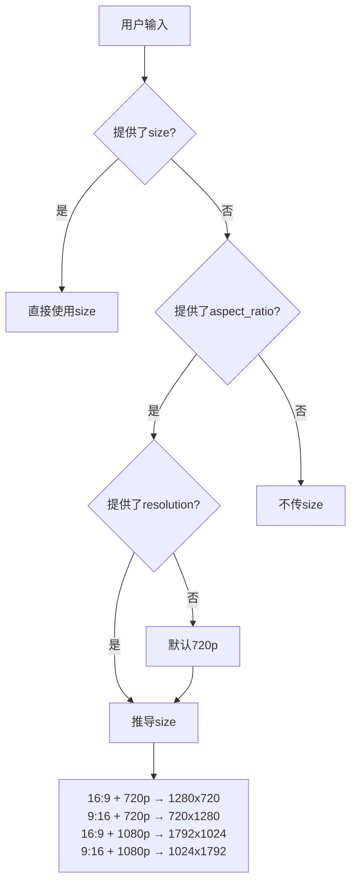

# Data Flow: AI Video Generation Page

## Data Transformation Diagram

```mermaid
flowchart LR
    subgraph Frontend["Frontend State"]
        UserInput[User Input]
        StoreState[Zustand Store State]
        RequestPayload[API Request Payload]
    end

    subgraph Backend["Backend Processing"]
        VideoRequest[VideoGenerationRequest]
        UpstreamPayload[Upstream API Payload]
        UpstreamResponse[Upstream Response]
        StoredVideo[StoredVideo Object]
    end

    subgraph Response["Response Flow"]
        VideoResponse[VideoGenerationResponse]
        UIState[UI Display State]
        FilmstripItem[Filmstrip Item]
    end

    UserInput -->|onChange| StoreState
    StoreState -->|buildRequest| RequestPayload
    RequestPayload -->|POST API| VideoRequest

    VideoRequest -->|adapter| UpstreamPayload
    UpstreamPayload -->|HTTP| UpstreamResponse
    UpstreamResponse -->|download+store| StoredVideo

    StoredVideo -->|sign URL| VideoResponse
    VideoResponse -->|SWR| UIState
    UIState -->|persist| FilmstripItem
```



## Data Structures

### Stage 1: Frontend User Input State

```typescript
// frontend/lib/stores/video-composer-store.ts (待创建)
interface VideoComposerState {
  // 核心输入
  prompt: string;                    // 用户提示词
  referenceImage?: string;           // I2V参考图URL/Base64

  // 高频配置 (Magic Bar可见)
  aspectRatio: '16:9' | '9:16' | '1:1' | '4:3' | '3:4' | '21:9';

  // 低频配置 (Drawer内)
  model: string;                     // 模型ID: sora-2, veo-2, etc.
  resolution: '480p' | '720p' | '1080p';
  duration: 5 | 8 | 10 | 12;         // 秒数
  negativePrompt?: string;           // 负向提示
  seed?: number;                     // 随机种子
  motionBucket?: number;             // 动态强度 1-10
  cameraControl?: CameraControl;     // 运镜控制

  // UI状态
  isGenerating: boolean;
  history: VideoHistoryItem[];
}

interface CameraControl {
  horizontal?: 'left' | 'right' | 'none';
  vertical?: 'up' | 'down' | 'none';
  zoom?: 'in' | 'out' | 'none';
  pan?: number;   // -180 to 180
  tilt?: number;  // -90 to 90
  roll?: number;  // -180 to 180
}

interface VideoHistoryItem {
  id: string;
  prompt: string;
  params: VideoComposerState;
  status: 'pending' | 'success' | 'failed';
  result?: VideoGenerationResult;
  createdAt: number;
}
```

### Stage 2: API Request Payload

```typescript
// frontend/lib/api-types.ts (扩展)
interface VideoGenerationRequest {
  prompt: string;
  model: string;
  size?: string;                     // "1280x720"
  seconds?: number;
  aspect_ratio?: string;
  resolution?: string;
  negative_prompt?: string;
  seed?: number;
  fps?: number;
  num_outputs?: number;
  generate_audio?: boolean;
  enhance_prompt?: boolean;
  extra_body?: {
    openai?: Record<string, unknown>;
    google?: Record<string, unknown>;
  };
}
```

### Stage 3: Backend VideoGenerationRequest (Pydantic)

```python
# backend/app/schemas/video.py:6-68
class VideoGenerationRequest(BaseModel):
    prompt: str                       # 必填
    model: str                        # 必填
    size: Optional[str]               # "1280x720"
    seconds: Optional[int]            # ge=1
    aspect_ratio: Optional[Literal["16:9", "9:16", "1:1", "4:3", "3:4", "21:9"]]
    resolution: Optional[Literal["480p", "720p", "1080p"]]
    negative_prompt: Optional[str]    # max_length=20000
    seed: Optional[int]               # ge=0
    fps: Optional[int]                # 1-120
    num_outputs: Optional[int]        # 1-4
    generate_audio: Optional[bool]
    enhance_prompt: Optional[bool]
    extra_body: Optional[dict]        # 厂商特定参数
```

### Stage 4: OpenAI Upstream Payload (Multipart)

```python
# backend/app/services/video_app_service.py:185-204
# _build_openai_videos_multipart_fields 输出
multipart_fields = {
    "prompt": (None, "A cyberpunk city in rain..."),
    "model": (None, "sora-2"),
    "size": (None, "1280x720"),      # 从 aspect_ratio+resolution 推导
    "seconds": (None, "8"),
}
# 支持的 size 枚举: 720x1280, 1280x720, 1024x1792, 1792x1024
```

### Stage 5: Google Veo Upstream Payload (JSON)

```python
# backend/app/services/video_app_service.py:207-225
# _build_google_veo_predict_payload 输出
{
    "instances": [
        {"prompt": "A cyberpunk city in rain..."}
    ],
    "parameters": {
        "aspectRatio": "16:9",
        "negativePrompt": "blurry, low quality"
    }
}
# 可通过 extra_body.google 合并更多参数
```

### Stage 6: Upstream Response (Polling)

```python
# OpenAI Sora 状态响应
{
    "id": "video_abc123",
    "status": "completed",  # queued | in_progress | processing | completed | failed
    "error": None
}

# Google Veo 操作响应
{
    "name": "operations/12345",
    "done": True,
    "response": {
        "generateVideoResponse": {
            "generatedSamples": [
                {"video": {"uri": "gs://bucket/video.mp4"}}
            ]
        }
    }
}
```

### Stage 7: StoredVideo Object

```python
# backend/app/services/video_storage_service.py:174-179
@dataclass(frozen=True)
class StoredVideo:
    object_key: str       # "user_uploads/videos/2024/01/15/abc123.mp4"
    content_type: str     # "video/mp4"
    size_bytes: int       # 文件大小
```

### Stage 8: VideoGenerationResponse

```python
# backend/app/schemas/video.py:70-79
class VideoObject(BaseModel):
    url: Optional[str]           # 签名后的可访问URL
    object_key: Optional[str]    # OSS对象键
    revised_prompt: Optional[str] # 修订后的提示词

class VideoGenerationResponse(BaseModel):
    created: int                 # Unix timestamp
    data: list[VideoObject]      # 生成的视频列表
```

### Stage 9: Frontend Display State

```typescript
// 用于UI展示
interface VideoGenerationResult {
  videos: Array<{
    url: string;                 // 可播放的视频URL
    objectKey: string;
    revisedPrompt?: string;
  }>;
  created: number;
}

// Filmstrip 展示项
interface FilmstripVideoItem {
  id: string;
  thumbnailUrl?: string;
  videoUrl: string;
  prompt: string;
  status: 'rendering' | 'ready' | 'error';
  duration?: number;
  createdAt: Date;
}
```

## Transformations

| From | To | Transformer | File |
|------|-----|-------------|------|
| User Input | Store State | `setPrompt()`, `setAspectRatio()` | `video-composer-store.ts` |
| Store State | API Request | `buildVideoRequest()` | `page.tsx` |
| API Request | Pydantic Model | `model_validate()` | `video.py` |
| Request → OpenAI | Multipart Fields | `_build_openai_videos_multipart_fields()` | `video_app_service.py:185` |
| Request → Google | JSON Payload | `_build_google_veo_predict_payload()` | `video_app_service.py:207` |
| Video Bytes | StoredVideo | `store_video_bytes()` | `video_storage_service.py:181` |
| StoredVideo | Signed URL | `build_signed_video_url()` | `video_storage_service.py:228` |
| Response → UI | Display State | SWR mutation callback | `use-video-generations.ts` |

## Size/Ratio Derivation Logic



## Validation Rules

| Field | Frontend | Backend | API Contract |
|-------|----------|---------|--------------|
| prompt | required, non-empty | required | 1-32000 chars |
| model | required | required | valid model ID |
| seconds | 5,8,10,12 select | ge=1 | OpenAI: 4,8,12 |
| aspect_ratio | enum select | Literal enum | 6 options |
| resolution | enum select | Literal enum | 3 options |
| seed | optional number | ge=0 | 0-4294967295 |
| fps | 16,24 select | 1-120 | provider-specific |
