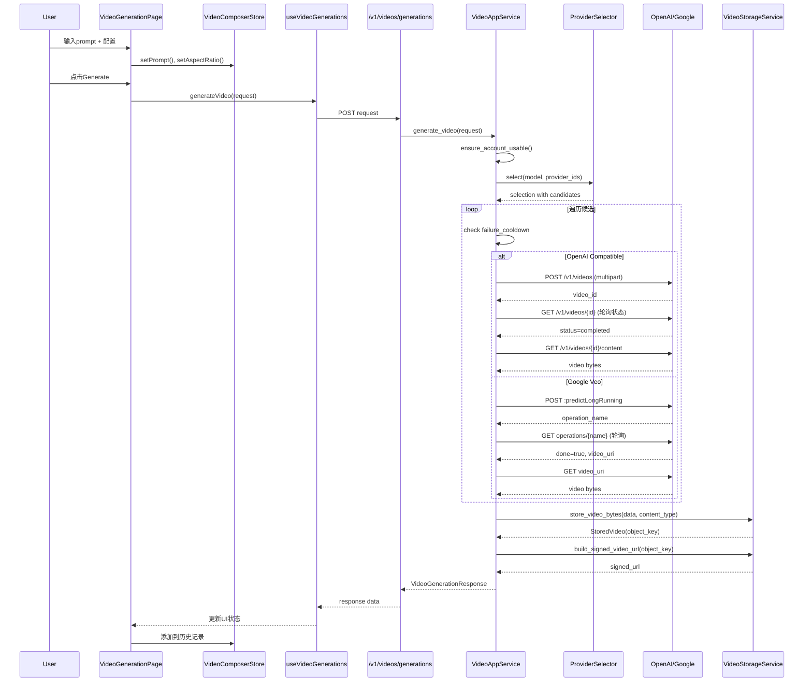

# Function Call Chains: AI Video Generation Page

## Call Sequence Diagram



## Detailed Call Chains

### Chain 1: 用户输入到状态更新

**Description**: 用户在Magic Bar输入prompt和配置参数

```typescript
// frontend/app/video/page.tsx
handlePromptChange(value: string)
  └─→ useVideoComposerStore.setPrompt(value)
      └─→ zustand persist → localStorage

handleAspectRatioChange(ratio: AspectRatio)
  └─→ useVideoComposerStore.setAspectRatio(ratio)
      └─→ 触发UI重渲染

handleOpenSettings()
  └─→ setIsSheetOpen(true)
      └─→ Sheet组件滑入动画
```

### Chain 2: 视频生成请求流程

**Description**: 从点击生成到API调用

```typescript
// frontend/app/video/page.tsx
handleGenerate()
  └─→ validatePrompt() // 校验非空
  └─→ buildVideoRequest() // 组装请求体
      └─→ {
            prompt: store.prompt,
            model: store.model,
            aspect_ratio: store.aspectRatio,
            resolution: store.resolution,
            negative_prompt: store.negativePrompt,
            seed: store.seed,
          }
  └─→ generateVideo(request) // SWR mutation
      └─→ POST /v1/videos/generations
          └─→ headers: { Authorization: Bearer ${token} }
```

### Chain 3: 后端视频生成核心流程

**Description**: VideoAppService.generate_video 完整流程

```python
# backend/app/services/video_app_service.py:311-364
async def generate_video(self, request: VideoGenerationRequest) -> VideoGenerationResponse:
    │
    ├─→ ensure_account_usable(db, user_id)  # 检查积分/账户状态
    │   └─→ raise InsufficientCreditsError if not enough
    │
    ├─→ get_accessible_provider_ids(db, user_id)  # 获取可用provider
    │   └─→ filter by api_key restrictions
    │
    ├─→ provider_selector.select(
    │       requested_model=model,
    │       effective_provider_ids=ids,
    │   )
    │   └─→ return Selection with ordered_candidates
    │
    ├─→ validate ModelCapability.VIDEO_GENERATION
    │   └─→ raise HTTPException if not supported
    │
    └─→ _generate_with_mixed_lanes(request, selection)
        └─→ iterate candidates, try each provider
```

### Chain 4: OpenAI Sora 视频生成

**Description**: OpenAI兼容API调用链

```python
# backend/app/services/video_app_service.py:448-576
async def _call_openai_videos(...) -> VideoGenerationResponse:
    │
    ├─→ _derive_openai_videos_path(chat_completions_path)
    │   └─→ "/v1/chat/completions" → "/v1/videos"
    │
    ├─→ _build_openai_videos_multipart_fields(request, model_id)
    │   ├─→ _choose_openai_sora_size_from_hints(size, aspect_ratio, resolution)
    │   └─→ return {prompt, model, size, seconds} as multipart
    │
    ├─→ http_client.post(url, files=multipart_fields)
    │   └─→ parse response → video_id
    │
    ├─→ POLLING LOOP (deadline=600s):
    │   ├─→ http_client.get(status_url)
    │   ├─→ check status: queued/in_progress → sleep(2s)
    │   ├─→ status=failed → raise HTTPException
    │   └─→ status=completed → break
    │
    ├─→ http_client.get(content_url, params={variant: "video"})
    │   └─→ download video bytes
    │
    └─→ store_video_bytes(content, content_type)
        └─→ build_signed_video_url(object_key)
```

### Chain 5: Google Veo 视频生成

**Description**: Google原生API调用链

```python
# backend/app/services/video_app_service.py:578-691
async def _call_google_veo_predict_long_running(...) -> VideoGenerationResponse:
    │
    ├─→ _google_v1beta_base(base_url)
    │   └─→ ensure "/v1beta" suffix
    │
    ├─→ _build_google_veo_predict_payload(request)
    │   ├─→ parameters.aspectRatio = aspect_ratio
    │   ├─→ parameters.negativePrompt = negative_prompt
    │   └─→ _deep_merge_dict with vendor_extra.google
    │
    ├─→ http_client.post(url, json=payload)
    │   └─→ parse response → operation_name
    │
    ├─→ POLLING LOOP (deadline=900s):
    │   ├─→ http_client.get(op_url)
    │   ├─→ check done: false → sleep(5s)
    │   ├─→ error in response → raise HTTPException
    │   └─→ done=true → extract video_uri
    │
    ├─→ http_client.get(video_uri)
    │   └─→ download video bytes
    │
    └─→ store_video_bytes(content, content_type)
        └─→ build_signed_video_url(object_key)
```

### Chain 6: 视频存储流程

**Description**: 视频内容存储到持久化后端

```python
# backend/app/services/video_storage_service.py:181-219
async def store_video_bytes(data: bytes, content_type: str) -> StoredVideo:
    │
    ├─→ _guess_ext(content_type)
    │   └─→ "video/mp4" → "mp4", "video/webm" → "webm"
    │
    ├─→ _build_object_key(ext=ext)
    │   └─→ "{prefix}/videos/{YYYY}/{MM}/{DD}/{uuid}.{ext}"
    │
    ├─→ get_effective_video_storage_mode()
    │   └─→ "local" | "oss" based on environment
    │
    ├─→ mode == "local":
    │   └─→ _local_path_for_object_key() → path.write_bytes(data)
    │
    ├─→ mode == "oss":
    │   ├─→ _oss_backend_kind() → "aliyun_oss" | "s3"
    │   ├─→ aliyun: bucket.put_object(object_key, data)
    │   └─→ s3: client.put_object(Bucket, Key, Body)
    │
    └─→ return StoredVideo(object_key, content_type, size_bytes)
```

## Parameters & Returns

| Function | Parameters | Returns |
|----------|------------|---------|
| `generate_video` | `VideoGenerationRequest` | `VideoGenerationResponse` |
| `_call_openai_videos` | `request, selection, cfg, ...` | `VideoGenerationResponse` |
| `_call_google_veo_predict_long_running` | `request, selection, cfg, ...` | `VideoGenerationResponse` |
| `store_video_bytes` | `data: bytes, content_type: str` | `StoredVideo` |
| `build_signed_video_url` | `object_key: str, ttl_seconds?` | `str (signed URL)` |
| `provider_selector.select` | `model, provider_ids, user_id` | `Selection` |

## Error Handling Functions

| Function | Error Type | Handling |
|----------|------------|----------|
| `ensure_account_usable` | `InsufficientCreditsError` | HTTP 402 |
| `acquire_provider_key` | `NoAvailableProviderKey` | Skip candidate |
| `_extract_openai_video_status` | status="failed" | HTTP 502 |
| `verify_signed_video_request` | `SignedVideoUrlError` | HTTP 403 |
