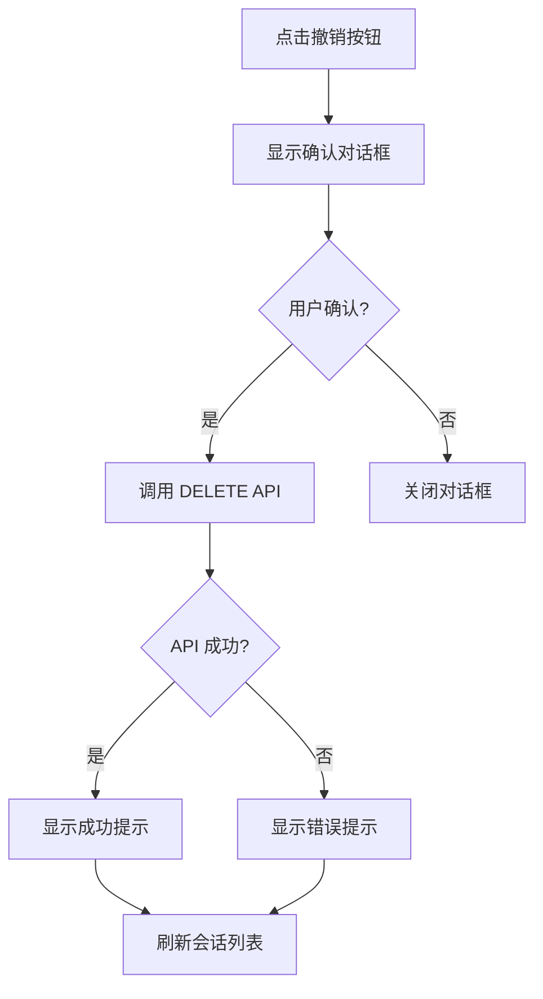

# 会话管理页面设计方案

## 1. 概述

本文档详细描述会话管理功能的前端设计方案。根据需求分析和现有代码结构，我们将采用**集成方案**，在现有的 Profile 页面（`/profile`）中添加会话管理功能。

### 1.1 设计目标

- 让用户能够查看和管理所有活跃的登录会话
- 提供远程登出功能，增强账户安全性
- 遵循项目的极简墨水风格设计规范
- 保持与现有 Profile 页面的一致性

### 1.2 优先级

⭐⭐ 中优先级

## 2. 页面结构设计

### 2.1 页面路径

**路径**: `/profile`（现有页面，添加新卡片）

### 2.2 布局方案

在现有 Profile 页面的"Security"卡片之后，添加新的"Active Sessions"卡片。整体布局顺序：

```
/profile
├── Profile Information (现有)
├── Security (现有)
├── Active Sessions (新增) ⭐
├── Preferences (现有)
└── Danger Zone (现有)
```

### 2.3 页面结构图

```
┌─────────────────────────────────────────────────────────┐
│ My Profile                                              │
│ Manage your account settings and preferences           │
├─────────────────────────────────────────────────────────┤
│                                                         │
│ [Profile Information Card]                             │
│                                                         │
├─────────────────────────────────────────────────────────┤
│                                                         │
│ [Security Card]                                        │
│                                                         │
├─────────────────────────────────────────────────────────┤
│                                                         │
│ [Active Sessions Card] ⭐ NEW                          │
│ ┌─────────────────────────────────────────────────┐   │
│ │ 🖥️ Current Device (This device)                 │   │
│ │ Chrome on Windows • 192.168.1.100               │   │
│ │ Last active: Just now                           │   │
│ │ Logged in: 2 hours ago                          │   │
│ └─────────────────────────────────────────────────┘   │
│                                                         │
│ ┌─────────────────────────────────────────────────┐   │
│ │ 📱 Mobile Device                        [Revoke]│   │
│ │ Safari on iOS • 192.168.1.101                   │   │
│ │ Last active: 5 minutes ago                      │   │
│ │ Logged in: 1 day ago                            │   │
│ └─────────────────────────────────────────────────┘   │
│                                                         │
│ [Revoke All Other Sessions]                            │
│                                                         │
├─────────────────────────────────────────────────────────┤
│ [Preferences Card]                                     │
└─────────────────────────────────────────────────────────┘
```

## 3. 功能设计

### 3.1 核心功能

#### 3.1.1 查看活跃会话列表

**功能描述**：
- 显示当前用户的所有活跃会话
- 每个会话显示设备信息、IP地址、登录时间、最后活跃时间
- 标识当前会话（用户正在使用的设备）

**数据来源**：
- API: `GET /v1/sessions`
- 返回类型: `SessionResponse[]`

**显示信息**：
```typescript
interface SessionDisplay {
  session_id: string;           // 会话ID
  device_info: {
    user_agent: string;         // 解析后的设备信息
    ip_address: string;         // IP地址
  };
  created_at: string;           // 登录时间
  last_used_at: string;         // 最后活跃时间
  is_current: boolean;          // 是否为当前会话
}
```

#### 3.1.2 撤销指定会话

**功能描述**：
- 用户可以撤销任何非当前会话
- 撤销后，该设备将被强制登出
- 需要二次确认

**交互流程**：


**API调用**：
- 端点: `DELETE /v1/sessions/{session_id}`
- 参数: `session_id` (路径参数)

#### 3.1.3 撤销所有其他会话

**功能描述**：
- 一键撤销除当前会话外的所有会话
- 适用于账户安全受威胁的场景
- 需要二次确认

**API调用**：
- 端点: `DELETE /v1/sessions/others`
- 无需参数

### 3.2 设备信息解析

**User-Agent 解析规则**：

```typescript
// 解析 User-Agent 字符串，提取设备和浏览器信息
function parseUserAgent(userAgent: string): {
  browser: string;
  os: string;
  deviceType: 'desktop' | 'mobile' | 'tablet' | 'unknown';
} {
  // 示例实现
  // Chrome on Windows -> { browser: 'Chrome', os: 'Windows', deviceType: 'desktop' }
  // Safari on iOS -> { browser: 'Safari', os: 'iOS', deviceType: 'mobile' }
}
```

**显示格式**：
- 桌面设备: `Chrome on Windows`
- 移动设备: `Safari on iOS`
- 未知设备: `Unknown Device`

### 3.3 时间显示

**相对时间格式**：
- 刚刚: `Just now` (< 1分钟)
- 分钟前: `5 minutes ago` (< 1小时)
- 小时前: `2 hours ago` (< 24小时)
- 天前: `3 days ago` (< 7天)
- 具体日期: `2024-12-01 14:30` (>= 7天)

## 4. UI/UX 设计

### 4.1 设计原则

遵循 `ui-prompt.md` 中的极简墨水风格：

1. **极简主义**：最少元素，最大功能
2. **留白充足**：卡片间距 24px，内部间距 20px
3. **色彩克制**：主要使用黑白灰，状态色点缀
4. **清晰层级**：通过间距和字重区分信息层级

### 4.2 会话卡片设计

#### 4.2.1 当前会话卡片

```
┌─────────────────────────────────────────────────────────┐
│ 🖥️ Current Device                                       │
│ Chrome on Windows                                       │
│ 192.168.1.100                                          │
│                                                         │
│ Last active: Just now                                  │
│ Logged in: 2 hours ago                                 │
└─────────────────────────────────────────────────────────┘
```

**样式特征**：
- 浅色背景 (`bg-muted/30`)
- 绿色边框 (`border-green-500/20`)
- "Current Device" 标签带绿色圆点
- 无撤销按钮

#### 4.2.2 其他会话卡片

```
┌─────────────────────────────────────────────────────────┐
│ 📱 Mobile Device                            [Revoke]    │
│ Safari on iOS                                          │
│ 192.168.1.101                                          │
│                                                         │
│ Last active: 5 minutes ago                             │
│ Logged in: 1 day ago                                   │
└─────────────────────────────────────────────────────────┘
```

**样式特征**：
- 白色背景 (`bg-card`)
- 灰色边框 (`border`)
- 右上角撤销按钮 (`variant="ghost"`)
- 悬停时显示阴影

### 4.3 图标使用

使用 `lucide-react` 图标库：

- 桌面设备: `Monitor` 或 `Laptop`
- 移动设备: `Smartphone`
- 平板设备: `Tablet`
- 未知设备: `HelpCircle`
- 当前会话标识: `CheckCircle2` (绿色)
- 撤销操作: `X` 或 `LogOut`

### 4.4 确认对话框设计

#### 4.4.1 撤销单个会话

```
┌─────────────────────────────────────────┐
│ Revoke Session?                         │
├─────────────────────────────────────────┤
│                                         │
│ Are you sure you want to revoke this   │
│ session? The device will be logged out │
│ immediately.                            │
│                                         │
│ Device: Chrome on Windows               │
│ IP: 192.168.1.100                      │
│                                         │
│         [Cancel]  [Revoke Session]     │
└─────────────────────────────────────────┘
```

#### 4.4.2 撤销所有其他会话

```
┌─────────────────────────────────────────┐
│ Revoke All Other Sessions?              │
├─────────────────────────────────────────┤
│                                         │
│ This will log out all devices except   │
│ this one. You'll need to log in again  │
│ on those devices.                       │
│                                         │
│ Sessions to revoke: 3                   │
│                                         │
│    [Cancel]  [Revoke All Sessions]     │
└─────────────────────────────────────────┘
```

**对话框组件**：使用 `@/components/ui/alert-dialog`

## 5. 技术实现方案

### 5.1 文件结构

```
frontend/
├── app/
│   └── profile/
│       ├── page.tsx (修改：添加会话管理卡片)
│       └── components/
│           ├── session-card.tsx (新增：会话卡片组件)
│           └── revoke-session-dialog.tsx (新增：撤销确认对话框)
├── http/
│   └── session.ts (新增：会话管理 API 客户端)
├── lib/
│   ├── api-types.ts (修改：添加会话相关类型)
│   ├── swr/
│   │   └── use-sessions.ts (新增：会话管理 SWR Hook)
│   ├── i18n/
│   │   └── sessions.ts (新增：会话管理国际化文案)
│   └── utils/
│       ├── user-agent-parser.ts (新增：User-Agent 解析工具)
│       └── time-formatter.ts (新增：时间格式化工具)
```

### 5.2 类型定义

**文件**: `frontend/lib/api-types.ts`

```typescript
// ============= 会话管理相关 =============

export interface DeviceInfo {
  user_agent: string | null;
  ip_address: string | null;
}

export interface SessionResponse {
  session_id: string;
  created_at: string;
  last_used_at: string;
  device_info: DeviceInfo | null;
  is_current: boolean;
}

export interface ParsedDeviceInfo {
  browser: string;
  os: string;
  deviceType: 'desktop' | 'mobile' | 'tablet' | 'unknown';
  icon: 'Monitor' | 'Smartphone' | 'Tablet' | 'HelpCircle';
}
```

### 5.3 API 客户端

**文件**: `frontend/http/session.ts`

```typescript
import { httpClient } from './client';
import type { SessionResponse } from '@/lib/api-types';

export const sessionService = {
  // 获取会话列表
  getSessions: async (): Promise<SessionResponse[]> => {
    const response = await httpClient.get('/v1/sessions');
    return response.data;
  },

  // 撤销指定会话
  revokeSession: async (sessionId: string): Promise<{ message: string }> => {
    const response = await httpClient.delete(`/v1/sessions/${sessionId}`);
    return response.data;
  },

  // 撤销所有其他会话
  revokeOtherSessions: async (): Promise<{ message: string }> => {
    const response = await httpClient.delete('/v1/sessions/others');
    return response.data;
  },
};
```

### 5.4 SWR Hook

**文件**: `frontend/lib/swr/use-sessions.ts`

```typescript
"use client";

import { useCallback } from 'react';
import { useApiGet, useApiDelete } from './hooks';
import { sessionService } from '@/http/session';
import type { SessionResponse } from '@/lib/api-types';

/**
 * 获取当前用户的所有活跃会话
 */
export const useSessions = () => {
  const {
    data,
    error,
    loading,
    refresh
  } = useApiGet<SessionResponse[]>(
    '/v1/sessions',
    { strategy: 'frequent' }
  );

  return {
    sessions: data || [],
    loading,
    error,
    refresh
  };
};

/**
 * 撤销会话操作
 */
export const useRevokeSession = () => {
  const revokeMutation = useApiDelete<{ message: string }>('');

  const revokeSession = useCallback(async (sessionId: string) => {
    return await sessionService.revokeSession(sessionId);
  }, []);

  const revokeOtherSessions = useCallback(async () => {
    return await sessionService.revokeOtherSessions();
  }, []);

  return {
    revokeSession,
    revokeOtherSessions,
    submitting: revokeMutation.submitting,
  };
};
```

### 5.5 工具函数

#### 5.5.1 User-Agent 解析

**文件**: `frontend/lib/utils/user-agent-parser.ts`

```typescript
import type { ParsedDeviceInfo } from '@/lib/api-types';

export function parseUserAgent(userAgent: string | null): ParsedDeviceInfo {
  if (!userAgent) {
    return {
      browser: 'Unknown',
      os: 'Unknown',
      deviceType: 'unknown',
      icon: 'HelpCircle',
    };
  }

  const ua = userAgent.toLowerCase();
  
  // 检测操作系统
  let os = 'Unknown';
  if (ua.includes('windows')) os = 'Windows';
  else if (ua.includes('mac os')) os = 'macOS';
  else if (ua.includes('linux')) os = 'Linux';
  else if (ua.includes('android')) os = 'Android';
  else if (ua.includes('ios') || ua.includes('iphone') || ua.includes('ipad')) os = 'iOS';

  // 检测浏览器
  let browser = 'Unknown';
  if (ua.includes('chrome') && !ua.includes('edg')) browser = 'Chrome';
  else if (ua.includes('safari') && !ua.includes('chrome')) browser = 'Safari';
  else if (ua.includes('firefox')) browser = 'Firefox';
  else if (ua.includes('edg')) browser = 'Edge';

  // 检测设备类型
  let deviceType: ParsedDeviceInfo['deviceType'] = 'unknown';
  let icon: ParsedDeviceInfo['icon'] = 'HelpCircle';
  
  if (ua.includes('mobile') || ua.includes('android') || ua.includes('iphone')) {
    deviceType = 'mobile';
    icon = 'Smartphone';
  } else if (ua.includes('tablet') || ua.includes('ipad')) {
    deviceType = 'tablet';
    icon = 'Tablet';
  } else if (os !== 'Unknown') {
    deviceType = 'desktop';
    icon = 'Monitor';
  }

  return { browser, os, deviceType, icon };
}

export function formatDeviceInfo(parsed: ParsedDeviceInfo): string {
  if (parsed.browser === 'Unknown' && parsed.os === 'Unknown') {
    return 'Unknown Device';
  }
  return `${parsed.browser} on ${parsed.os}`;
}
```

#### 5.5.2 时间格式化

**文件**: `frontend/lib/utils/time-formatter.ts`

```typescript
export function formatRelativeTime(dateString: string, locale: 'en' | 'zh' = 'en'): string {
  const date = new Date(dateString);
  const now = new Date();
  const diffMs = now.getTime() - date.getTime();
  const diffMinutes = Math.floor(diffMs / 60000);
  const diffHours = Math.floor(diffMs / 3600000);
  const diffDays = Math.floor(diffMs / 86400000);

  if (locale === 'zh') {
    if (diffMinutes < 1) return '刚刚';
    if (diffMinutes < 60) return `${diffMinutes} 分钟前`;
    if (diffHours < 24) return `${diffHours} 小时前`;
    if (diffDays < 7) return `${diffDays} 天前`;
    return date.toLocaleString('zh-CN', {
      year: 'numeric',
      month: '2-digit',
      day: '2-digit',
      hour: '2-digit',
      minute: '2-digit',
    });
  }

  // English
  if (diffMinutes < 1) return 'Just now';
  if (diffMinutes < 60) return `${diffMinutes} minute${diffMinutes > 1 ? 's' : ''} ago`;
  if (diffHours < 24) return `${diffHours} hour${diffHours > 1 ? 's' : ''} ago`;
  if (diffDays < 7) return `${diffDays} day${diffDays > 1 ? 's' : ''} ago`;
  return date.toLocaleString('en-US', {
    year: 'numeric',
    month: '2-digit',
    day: '2-digit',
    hour: '2-digit',
    minute: '2-digit',
  });
}
```

### 5.6 组件实现

#### 5.6.1 会话卡片组件

**文件**: `frontend/app/profile/components/session-card.tsx`

```typescript
"use client";

import React from 'react';
import { Card, CardContent } from '@/components/ui/card';
import { Button } from '@/components/ui/button';
import { Monitor, Smartphone, Tablet, HelpCircle, CheckCircle2 } from 'lucide-react';
import { cn } from '@/lib/utils';
import { parseUserAgent, formatDeviceInfo } from '@/lib/utils/user-agent-parser';
import { formatRelativeTime } from '@/lib/utils/time-formatter';
import { useI18n } from '@/lib/i18n-context';
import type { SessionResponse } from '@/lib/api-types';

interface SessionCardProps {
  session: SessionResponse;
  onRevoke: (sessionId: string) => void;
}

const iconMap = {
  Monitor,
  Smartphone,
  Tablet,
  HelpCircle,
};

export function SessionCard({ session, onRevoke }: SessionCardProps) {
  const { t, language } = useI18n();
  const parsed = parseUserAgent(session.device_info?.user_agent || null);
  const DeviceIcon = iconMap[parsed.icon];

  return (
    <Card
      className={cn(
        'relative',
        session.is_current && 'bg-muted/30 border-green-500/20'
      )}
    >
      <CardContent className="p-4">
        <div className="flex items-start justify-between">
          <div className="flex items-start space-x-3 flex-1">
            <DeviceIcon className="w-5 h-5 text-muted-foreground mt-0.5" />
            <div className="flex-1 min-w-0">
              <div className="flex items-center space-x-2 mb-1">
                <h4 className="text-sm font-medium">
                  {session.is_current ? (
                    <span className="flex items-center space-x-1.5">
                      <CheckCircle2 className="w-4 h-4 text-green-600" />
                      <span>{t('sessions.current_device')}</span>
                    </span>
                  ) : (
                    formatDeviceInfo(parsed)
                  )}
                </h4>
              </div>
              <p className="text-xs text-muted-foreground mb-2">
                {session.device_info?.ip_address || t('sessions.unknown_ip')}
              </p>
              <div className="space-y-0.5 text-xs text-muted-foreground">
                <p>
                  {t('sessions.last_active')}: {formatRelativeTime(session.last_used_at, language)}
                </p>
                <p>
                  {t('sessions.logged_in')}: {formatRelativeTime(session.created_at, language)}
                </p>
              </div>
            </div>
          </div>
          {!session.is_current && (
            <Button
              variant="ghost"
              size="sm"
              onClick={() => onRevoke(session.session_id)}
              className="text-destructive hover:text-destructive hover:bg-destructive/10"
            >
              {t('sessions.revoke')}
            </Button>
          )}
        </div>
      </CardContent>
    </Card>
  );
}
```

#### 5.6.2 撤销确认对话框

**文件**: `frontend/app/profile/components/revoke-session-dialog.tsx`

```typescript
"use client";

import React from 'react';
import {
  AlertDialog,
  AlertDialogAction,
  AlertDialogCancel,
  AlertDialogContent,
  AlertDialogDescription,
  AlertDialogFooter,
  AlertDialogHeader,
  AlertDialogTitle,
} from '@/components/ui/alert-dialog';
import { useI18n } from '@/lib/i18n-context';
import { parseUserAgent, formatDeviceInfo } from '@/lib/utils/user-agent-parser';
import type { SessionResponse } from '@/lib/api-types';

interface RevokeSessionDialogProps {
  open: boolean;
  onOpenChange: (open: boolean) => void;
  session: SessionResponse | null;
  onConfirm: () => void;
  isRevoking: boolean;
}

export function RevokeSessionDialog({
  open,
  onOpenChange,
  session,
  onConfirm,
  isRevoking,
}: RevokeSessionDialogProps) {
  const { t } = useI18n();

  if (!session) return null;

  const parsed = parseUserAgent(session.device_info?.user_agent || null);
  const deviceInfo = formatDeviceInfo(parsed);

  return (
    <AlertDialog open={open} onOpenChange={onOpenChange}>
      <AlertDialogContent>
        <AlertDialogHeader>
          <AlertDialogTitle>{t('sessions.revoke_dialog_title')}</AlertDialogTitle>
          <AlertDialogDescription className="space-y-2">
            <p>{t('sessions.revoke_dialog_description')}</p>
            <div className="mt-3 p-3 bg-muted rounded-md text-sm">
              <p className="font-medium text-foreground">{deviceInfo}</p>
              <p className="text-muted-foreground">
                {session.device_info?.ip_address || t('sessions.unknown_ip')}
              </p>
            </div>
          </AlertDialogDescription>
        </AlertDialogHeader>
        <AlertDialogFooter>
          <AlertDialogCancel disabled={isRevoking}>
            {t('common.cancel')}
          </AlertDialogCancel>
          <AlertDialogAction
            onClick={onConfirm}
            disabled={isRevoking}
            className="bg-destructive text-destructive-foreground hover:bg-destructive/90"
          >
            {isRevoking ? t('sessions.revoking') : t('sessions.revoke_session')}
          </AlertDialogAction>
        </AlertDialogFooter>
      </AlertDialogContent>
    </AlertDialog>
  );
}

interface RevokeAllDialogProps {
  open: boolean;
  onOpenChange: (open: boolean) => void;
  sessionCount: number;
  onConfirm: () => void;
  isRevoking: boolean;
}

export function RevokeAllSessionsDialog({
  open,
  onOpenChange,
  sessionCount,
  onConfirm,
  isRevoking,
}: RevokeAllDialogProps) {
  const { t } = useI18n();

  return (
    <AlertDialog open={open} onOpenChange={onOpenChange}>
      <AlertDialogContent>
        <AlertDialogHeader>
          <AlertDialogTitle>{t('sessions.revoke_all_dialog_title')}</AlertDialogTitle>
          <AlertDialogDescription className="space-y-2">
            <p>{t('sessions.revoke_all_dialog_description')}</p>
            <div className="mt-3 p-3 bg-muted rounded-md text-sm">
              <p className="font-medium text-foreground">
                {t('sessions.sessions_to_revoke')}: {sessionCount}
              </p>
            </div>
          </AlertDialogDescription>
        </AlertDialogHeader>
        <AlertDialogFooter>
          <AlertDialogCancel disabled={isRevoking}>
            {t('common.cancel')}
          </AlertDialogCancel>
          <AlertDialogAction
            onClick={onConfirm}
            disabled={isRevoking}
            className="bg-destructive text-destructive-foreground hover:bg-destructive/90"
          >
            {isRevoking ? t('sessions.revoking') : t('sessions.revoke_all_sessions')}
          </AlertDialogAction>
        </AlertDialogFooter>
      </AlertDialogContent>
    </AlertDialog>
  );
}
```

### 5.7 Profile 页面集成

**文件**: `frontend/app/profile/page.tsx` (修改)

在 Security 卡片之后添加 Active Sessions 卡片：

```typescript
// ... 现有导入
import { SessionCard } from './components/session-card';
import { RevokeSessionDialog, RevokeAllSessionsDialog } from './components/revoke-session-dialog';
import { useSessions, useRevokeSession } from '@/lib/swr/use-sessions';
import { useI18n } from '@/lib/i18n-context';
import { useToast } from '@/hooks/use-toast';

export default function ProfilePage() {
  const { t } = useI18n();
  const { toast } = useToast();
  const { sessions, loading, refresh } = useSessions();
  const { revokeSession, revokeOtherSessions, submitting } = useRevokeSession();
  
  const [selectedSession, setSelectedSession] = useState<SessionResponse | null>(null);
  const [showRevokeDialog, setShowRevokeDialog] = useState(false);
  const [showRevokeAllDialog, setShowRevokeAllDialog] = useState(false);

  const otherSessionsCount = sessions.filter(s => !s.is_current).length;

  const handleRevoke = (sessionId: string) => {
    const session = sessions.find(s => s.session_id === sessionId);
    if (session) {
      setSelectedSession(session);
      setShowRevokeDialog(true);
    }
  };

  const handleConfirmRevoke = async () => {
    if (!selectedSession) return;
    
    try {
      await revokeSession(selectedSession.session_id);
      toast({
        title: t('sessions.revoke_success'),
        description: t('sessions.revoke_success_description'),
      });
      setShowRevokeDialog(false);
      refresh();
    } catch (error) {
      toast({
        title: t('sessions.revoke_error'),
        description: t('sessions.revoke_error_description'),
        variant: 'destructive',
      });
    }
  };

  const handleRevokeAll = async () => {
    try {
      await revokeOtherSessions();
      toast({
        title: t('sessions.revoke_all_success'),
        description: t('sessions.revoke_all_success_description'),
      });
      setShowRevokeAllDialog(false);
      refresh();
    } catch (error) {
      toast({
        title: t('sessions.revoke_all_error'),
        description: t('sessions.revoke_all_error_description'),
        variant: 'destructive',
      });
    }
  };

  return (
    <div className="max-w-4xl mx-auto p-6 space-y-6">
      {/* ... 现有的 Profile Information 和 Security 卡片 ... */}

      {/* Active Sessions */}
      <Card>
        <CardHeader>
          <CardTitle>{t('sessions.title')}</CardTitle>
          <CardDescription>{t('sessions.description')}</CardDescription>
        </CardHeader>
        <CardContent className="space-y-3">
          {loading ? (
            <div className="text-center py-8 text-muted-foreground">
              {t('common.loading')}
            </div>
          ) : sessions.length === 0 ? (
            <div className="text-center py-8 text-muted-foreground">
              {t('sessions.no_sessions')}
            </div>
          ) : (
            <>
              {sessions.map((session) => (
                <SessionCard
                  key={session.session_id}
                  session={session}
                  onRevoke={handleRevoke}
                />
              ))}
              
              {otherSessionsCount > 0 && (
                <div className="pt-4 border-t">
                  <Button
                    variant="outline"
                    className="w-full text-destructive hover:text-destructive hover:bg-destructive/10"
                    onClick={() => setShowRevokeAllDialog(true)}
                  >
                    {t('sessions.revoke_all_other_sessions')} ({otherSessionsCount})
                  </Button>
                </div>
              )}
            </>
          )}
        </CardContent>
      </Card>

      {/* ... 现有的 Preferences 和 Danger Zone 卡片 ... */}

      {/* Dialogs */}
      <RevokeSessionDialog
        open={showRevokeDialog}
        onOpenChange={setShowRevokeDialog}
        session={selectedSession}
        onConfirm={handleConfirmRevoke}
        isRevoking={submitting}
      />
      
      <RevokeAllSessionsDialog
        open={showRevokeAllDialog}
        onOpenChange={setShowRevokeAllDialog}
        sessionCount={otherSessionsCount}
        onConfirm={handleRevokeAll}
        isRevoking={submitting}
      />
    </div>
  );
}
```

## 6. 国际化文案

**文件**: `frontend/lib/i18n/sessions.ts`

```typescript
import type { Language } from "../i18n-context";

export const sessionsTranslations: Record<Language, Record<string, string>> = {
  en: {
    // 标题和描述
    "sessions.title": "Active Sessions",
    "sessions.description": "Manage your active login sessions across devices",
    
    // 会话信息
    "sessions.current_device": "Current Device",
    "sessions.last_active": "Last active",
    "sessions.logged_in": "Logged in",
    "sessions.unknown_ip": "Unknown IP",
    
    // 操作按钮
    "sessions.revoke": "Revoke",
    "sessions.revoke_all_other_sessions": "Revoke All Other Sessions",
    
    // 撤销单个会话对话框
    "sessions.revoke_dialog_title": "Revoke Session?",
    "sessions.revoke_dialog_description": "Are you sure you want to revoke this session? The device will be logged out immediately.",
    "sessions.revoke_session": "Revoke Session",
    "sessions.revoking": "Revoking...",
    
    // 撤销所有会话对话框
    "sessions.revoke_all_dialog_title": "Revoke All Other Sessions?",
    "sessions.revoke_all_dialog_description": "This will log out all devices except this one. You'll need to log in again on those devices.",
    "sessions.sessions_to_revoke": "Sessions to revoke",
    "sessions.revoke_all_sessions": "Revoke All Sessions",
    
    // 状态消息
    "sessions.no_sessions": "No active sessions",
    "sessions.revoke_success": "Session revoked",
    "sessions.revoke_success_description": "The session has been successfully revoked",
    "sessions.revoke_error": "Failed to revoke session",
    "sessions.revoke_error_description": "An error occurred while revoking the session",
    "sessions.revoke_all_success": "All sessions revoked",
    "sessions.revoke_all_success_description": "All other sessions have been successfully revoked",
    "sessions.revoke_all_error": "Failed to revoke sessions",
    "sessions.revoke_all_error_description": "An error occurred while revoking the sessions",
  },
  zh: {
    // 标题和描述
    "sessions.title": "活跃会话",
    "sessions.description": "管理您在不同设备上的登录会话",
    
    // 会话信息
    "sessions.current_device": "当前设备",
    "sessions.last_active": "最后活跃",
    "sessions.logged_in": "登录时间",
    "sessions.unknown_ip": "未知 IP",
    
    // 操作按钮
    "sessions.revoke": "撤销",
    "sessions.revoke_all_other_sessions": "撤销所有其他会话",
    
    // 撤销单个会话对话框
    "sessions.revoke_dialog_title": "撤销会话？",
    "sessions.revoke_dialog_description": "确定要撤销此会话吗？该设备将立即被登出。",
    "sessions.revoke_session": "撤销会话",
    "sessions.revoking": "撤销中...",
    
    // 撤销所有会话对话框
    "sessions.revoke_all_dialog_title": "撤销所有其他会话？",
    "sessions.revoke_all_dialog_description": "这将登出除当前设备外的所有设备。您需要在这些设备上重新登录。",
    "sessions.sessions_to_revoke": "将撤销的会话数",
    "sessions.revoke_all_sessions": "撤销所有会话",
    
    // 状态消息
    "sessions.no_sessions": "暂无活跃会话",
    "sessions.revoke_success": "会话已撤销",
    "sessions.revoke_success_description": "会话已成功撤销",
    "sessions.revoke_error": "撤销会话失败",
    "sessions.revoke_error_description": "撤销会话时发生错误",
    "sessions.revoke_all_success": "所有会话已撤销",
    "sessions.revoke_all_success_description": "所有其他会话已成功撤销",
    "sessions.revoke_all_error": "撤销会话失败",
    "sessions.revoke_all_error_description": "撤销会话时发生错误",
  },
};
```

**更新**: `frontend/lib/i18n/index.ts`

```typescript
// 添加导入
import { sessionsTranslations } from "./sessions";

// 在 mergeTranslations 中添加
export const allTranslations = mergeTranslations(
  // ... 现有的
  sessionsTranslations  // 新增
);

// 在导出中添加
export {
  // ... 现有的
  sessionsTranslations,  // 新增
};
```

## 7. 错误处理

### 7.1 API 错误处理

```typescript
// 在 SWR Hook 中处理错误
export const useSessions = () => {
  const { data, error, loading, refresh } = useApiGet<SessionResponse[]>(
    '/v1/sessions',
    { 
      strategy: 'frequent',
      onError: (error) => {
        console.error('Failed to fetch sessions:', error);
        // 可以在这里添加全局错误提示
      }
    }
  );

  return {
    sessions: data || [],
    loading,
    error,
    refresh
  };
};
```

### 7.2 网络错误处理

- 使用 SWR 的自动重试机制
- 显示友好的错误提示
- 提供手动刷新按钮

### 7.3 边界情况

1. **无会话数据**：显示"暂无活跃会话"提示
2. **只有当前会话**：隐藏"撤销所有其他会话"按钮
3. **API 调用失败**：显示错误提示，保持 UI 状态
4. **撤销当前会话**：不显示撤销按钮（后端也会拒绝）

## 8. 性能优化

### 8.1 数据缓存

- 使用 SWR 的 `frequent` 策略，平衡实时性和性能
- 撤销操作后手动刷新数据

### 8.2 组件优化

- 使用 `React.memo` 优化会话卡片组件
- 避免不必要的重渲染

### 8.3 懒加载

- 会话管理功能仅在 Profile 页面加载
- 对话框组件按需渲染

## 9. 安全考虑

### 9.1 权限验证

- 所有 API 调用都需要有效的 JWT token
- 用户只能查看和管理自己的会话

### 9.2 操作确认

- 所有撤销操作都需要二次确认
- 显示将要撤销的会话详情

### 9.3 敏感信息保护

- IP 地址完整显示（用于安全审计）
- User-Agent 解析后显示（更友好）

## 10. 测试建议

### 10.1 单元测试

- User-Agent 解析函数测试
- 时间格式化函数测试
- 组件渲染测试

### 10.2 集成测试

- API 调用测试
- SWR Hook 测试
- 完整流程测试

### 10.3 E2E 测试

- 查看会话列表
- 撤销单个会话
- 撤销所有其他会话
- 错误处理流程

## 11. 实施计划

### 11.1 第一阶段：基础功能（1-2天）

- [ ] 创建类型定义
- [ ] 实现 API 客户端
- [ ] 实现 SWR Hook
- [ ] 实现工具函数（User-Agent 解析、时间格式化）

### 11.2 第二阶段：UI 组件（2-3天）

- [ ] 实现会话卡片组件
- [ ] 实现撤销确认对话框
- [ ] 集成到 Profile 页面
- [ ] 添加国际化文案

### 11.3 第三阶段：测试和优化（1-2天）

- [ ] 编写单元测试
- [ ] 进行集成测试
- [ ] 性能优化
- [ ] 错误处理完善

### 11.4 第四阶段：文档和发布（1天）

- [ ] 更新 API 文档
- [ ] 编写用户指南
- [ ] 代码审查
- [ ] 部署上线

**总计**: 5-8 个工作日

## 12. 后续优化方向

### 12.1 功能增强

1. **会话详情**：点击会话卡片查看更多详情
2. **会话搜索**：支持按设备类型、IP 地址搜索
3. **会话通知**：新设备登录时发送通知
4. **会话历史**：查看已撤销的会话历史

### 12.2 安全增强

1. **异常登录检测**：检测异常 IP 或设备
2. **地理位置显示**：根据 IP 显示大致位置
3. **自动撤销**：长时间未活跃的会话自动撤销

### 12.3 用户体验

1. **会话分组**：按设备类型分组显示
2. **会话命名**：允许用户为设备命名
3. **快捷操作**：批量选择和撤销

## 13. 相关文档

- [后端会话管理 API](../../backend/app/api/v1/session_routes.py)
- [JWT Redis 存储设计](../../backend/jwt-redis-storage-plan.md)
- [前端 UI 设计规范](../../../ui-prompt.md)
- [前端架构文档](../../frontend/docs/frontend-design.md)

---

**文档版本**: 1.0  
**创建日期**: 2024-12-05  
**最后更新**: 2024-12-05  
**作者**: AI Architect  
**状态**: 待审核